# 🚀 Automated CI/CD Pipeline for a Flask Application on AWS

This project demonstrates a complete, end-to-end **CI/CD (Continuous Integration/Continuous Deployment)** pipeline for a containerized Python Flask web application.  

The pipeline automates the process from a `git push` in GitHub to a live, updated deployment on **AWS ECS with Fargate**.  

The goal is to showcase **core DevOps principles** — Infrastructure as Code (IaC), automation, and containerization — for a fresher-level **AWS DevOps / Solutions Architect** role.  

---

## 🛠️ Technologies Used

- **Cloud Platform:** AWS  
- **CI/CD Tool:** GitHub Actions  
- **Containerization:** Docker  
- **AWS Services:**  
  - Amazon ECS (Elastic Container Service)  
  - AWS Fargate  
  - Amazon ECR (Elastic Container Registry)  
  - AWS IAM (Identity & Access Management)  
- **Application Framework:** Python (Flask)  

---

## 📌 Step 1: IAM Setup

To allow GitHub Actions to interact with AWS securely, an **IAM user** with programmatic access was created.  

- User creation:  
  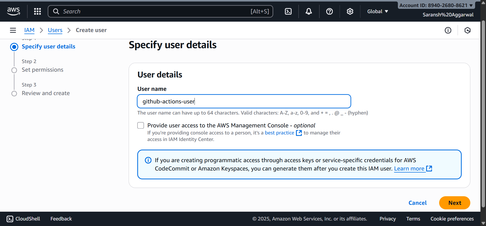  

- Initial permissions:  
  .png)  

- Policies added (ECR + ECS access):  
  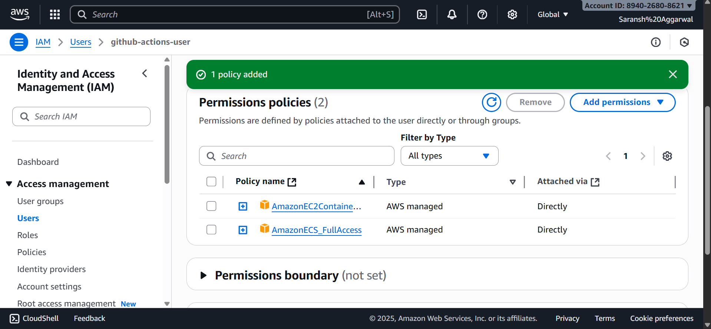  

---

## 📌 Step 2: GitHub Secrets

The IAM user’s Access Key & Secret Key were stored in **GitHub Secrets** for secure access.  

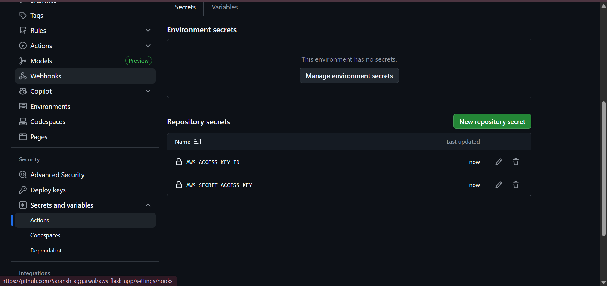

---

## 📌 Step 3: Amazon ECR Setup

A **private ECR repository** was created to store Docker images.  

- Initial repository setup:  
  .png)  

- Repository ready:  
  .png)  

- Container image pushed:  
  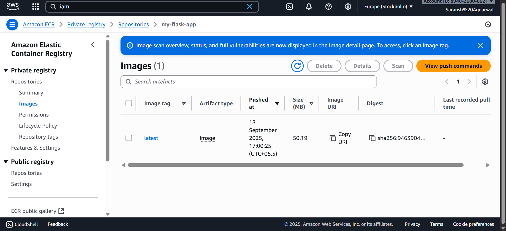  

---

## 📌 Step 4: Amazon ECS Setup

- ECS & ECR integration:  
  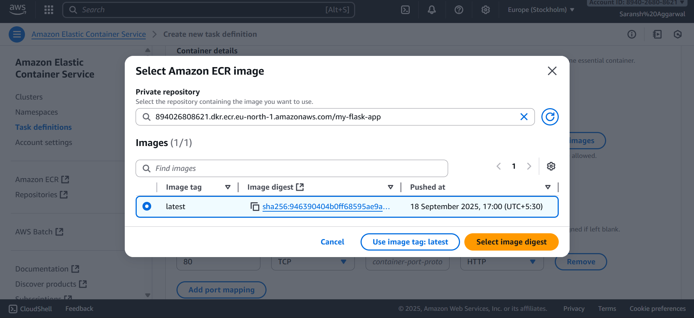  

- Cluster setup:  
  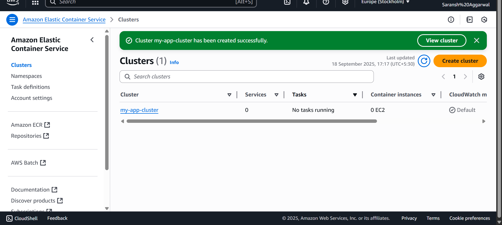  

- Security group setup (allow port 80 for app access):  
  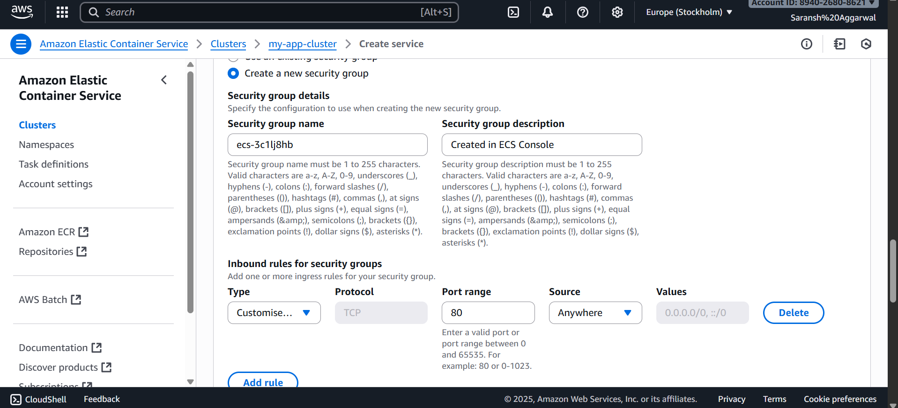  

---

## 📌 Step 5: Task Definition

The **task definition** specifies:  
- Docker image from ECR  
- CPU & memory requirements  
- Port mappings  

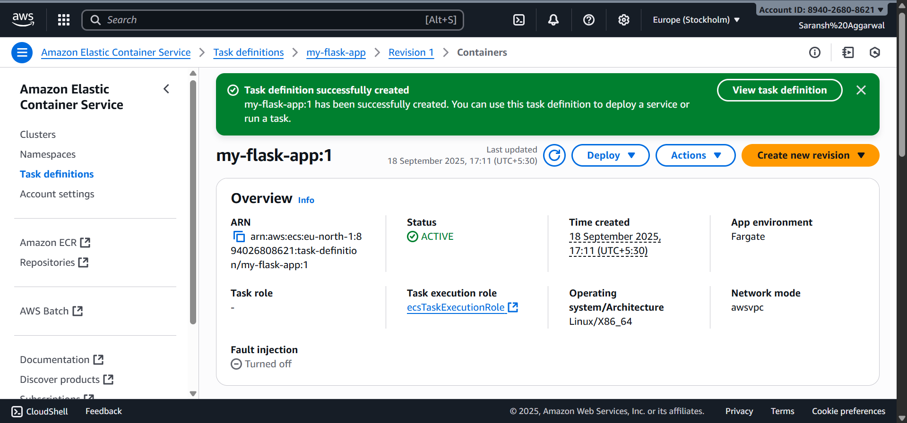  

---

## 📌 Step 6: Initial Deployment on ECS

Once the ECS service was created and the task definition launched, the Flask app was accessible on the public IP.  

**Initial Deployment Output (from the first container run on ECS):**  
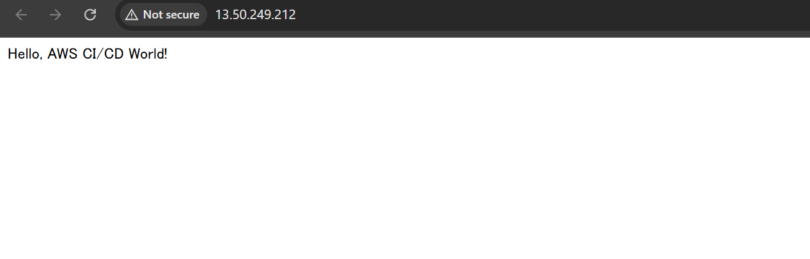  

---

## 📌 Step 7: GitHub Actions CI/CD Workflow

The CI/CD pipeline:  
- Builds Docker image  
- Pushes it to ECR  
- Deploys to ECS Fargate automatically  

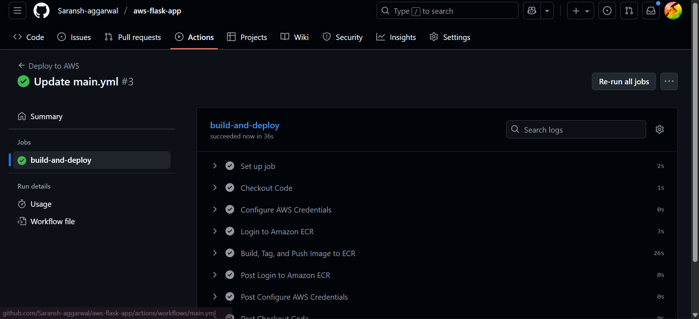  

---

## 📌 Step 8: Automated Update via CI/CD

When a change was made to the Python file and pushed to GitHub, the pipeline automatically built a new Docker image and redeployed it to ECS.  

**Final Output (after automated update via pipeline):**  
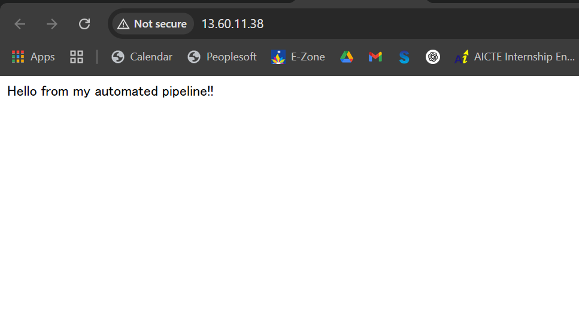  

---

## ✅ Key Learnings

- Setting up **secure AWS IAM roles** with least privilege access  
- Creating & managing **Docker container images with ECR**  
- Deploying scalable apps on **ECS Fargate**  
- Automating deployments using **GitHub Actions CI/CD**  
- Applying **DevOps practices** in a real-world cloud environment  

---
